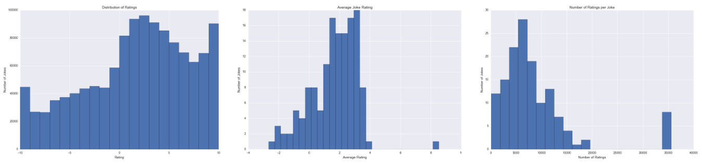
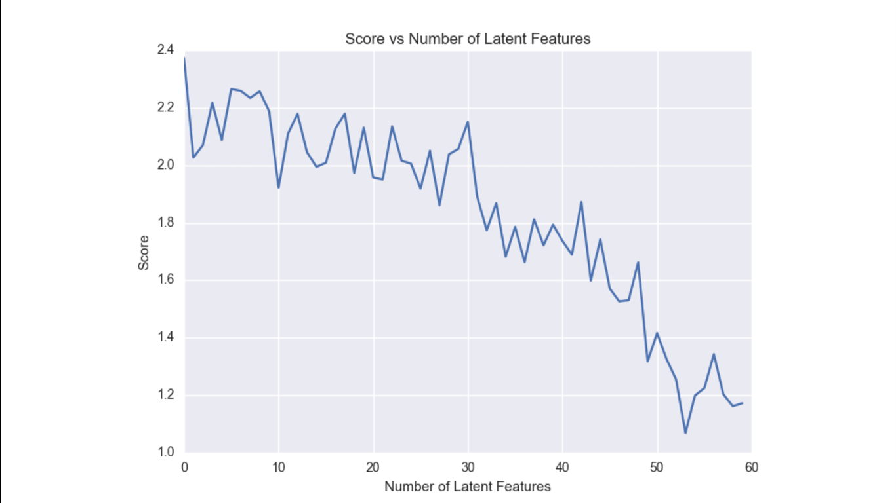

# Joke Recommender System

Recommendation system built based on a dataset of over 4 million ratings of jokes. Implemented an item similarity recommender and factorization recommenders using GraphLab.

- Task: Build a recommendation system for jokes
- Data: User ratings ranging from -10 to 10
- Scoring: Mean rating for top 5% of jokes predicted by recommender
- Tools: GraphLab, Pandas

### Exploratory Data Analysis
Distribution of Ratings, Average Joke Rating, Number of Ratings per Joke:

### Choosing a Model
- If you care about accurately predicting the rating a user would give a specific item - ___Factorization recommender___
- If you care about ranking performance, instead of simply predicting the rating accurately - ___Item Similarity Recommender___ or ___Ranking Factorization recommender___

More details [here](https://github.com/turi-code/userguide/blob/master/recommender/choosing-a-model.md
).

### Tuning Parameters for Factorization Recommenders

__Number of Latent Features:__
- Factorization Recommender:
    - Default: 8
    - Optimal: 2
- Ranking Factorization Recommender:
    - Default: 32
    - Optimal: 8

__Regularization:__ Default

### Model Results
- Factorization Recommender (num_factors=2)
    - Score: 2.5001
- Ranking Factorization Recommender (num_factors=8)
    - Score: 2.1726
- Item Similarity Recommender (similarity_type=pearson)
    - Score: 2.5301
- Item Similarity Recommender (similarity_type=cosine)
    - Score: 2.3010
- Item Similarity Recommender (similarity_type=jaccard)
    - Score: 1.5739
